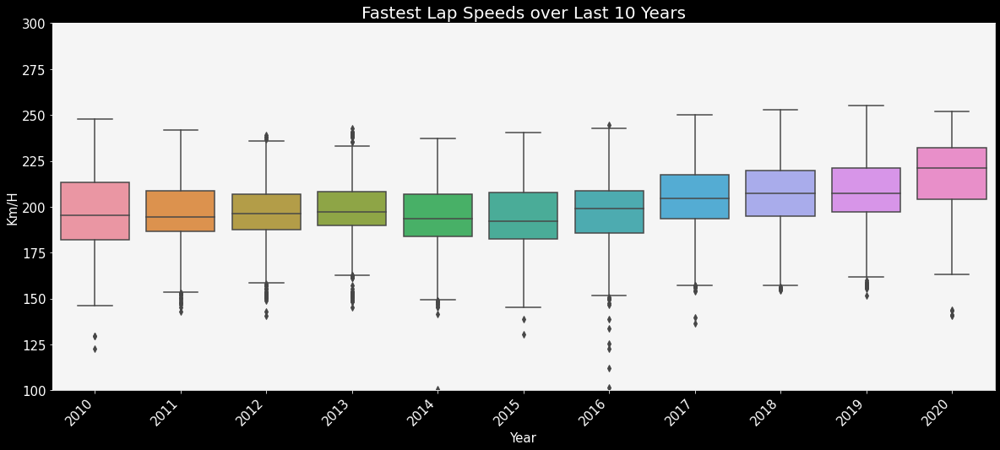

# Work in Progress

# Formula 1 Data Analysis

The purpose of this project is to analyze and explore various data points in Formula 1. I also tried to build a model to predict whether a driver will finish in the podiums or not.

## Data Collection
Initially, I had found this dataset on the popular data science community Kaggle. Then I found that this was in turn taken from the Ergast website. Since, the datasets on kaggle were quite outdated, I downloaded all the datasets from Ergast. Ergast has the option to use it's API to gather the data, but I found it easier to download all the data and use it.

The dataset had multiple .CSV files with each containing primary keys to allow for merging the data. The files that originally came with the data set are:

Dataset Files:

`circuits.csv`
`constructor_results.csv`
`constructor_standings.csv`
`constructors.csv`
`driver_standings.csv`
`drivers.csv`
`lap_times.csv`
`pit_stops.csv`
`qualifying.csv`
`races.csv`
`results.csv`
`seasons.csv`
`status.csv`

All the files were merged to create a final data frame called: `final_data.csv`

## EDA

Files : `f1_analysis`

### Worldwide circuit distribution.

We see most of the circuits are concentrated in Europe, followed by America.

### How have lap speeds evolved over the last 10 years?

We can see that the lap speeds have obviously seen a steady increase over the last 10 years. However, we see that post 2014, the average speeds have risen faster per year post the 1.6 V6 Turbo Engine rule change.

