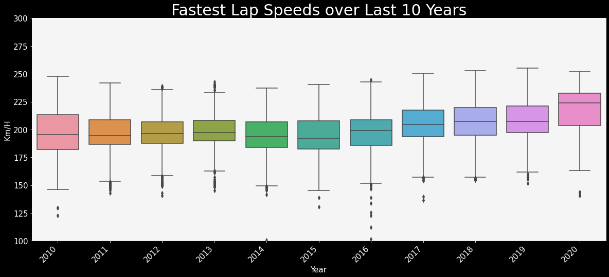

# Work in Progress

# Formula 1 Data Analysis

The purpose of this project is to analyze and explore various data points in Formula 1. I also tried to build a model to predict whether a driver will finish in the podiums or not.

## EDA

Files : `f1_analysis`

### How have lap speeds evolved over the last 10 years?

We can see that the lap speeds have obviously seen a steady increase over the last 10 years. However, we see that post 2014, the average speeds have risen faster per year post the 1.6 V6 Turbo Engine rule change.

