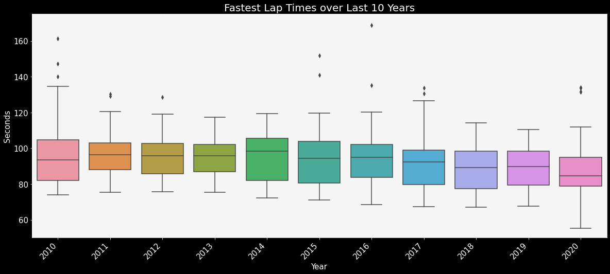
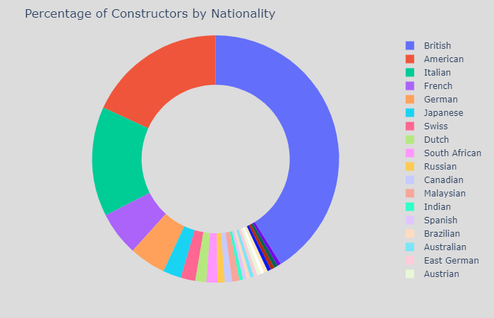
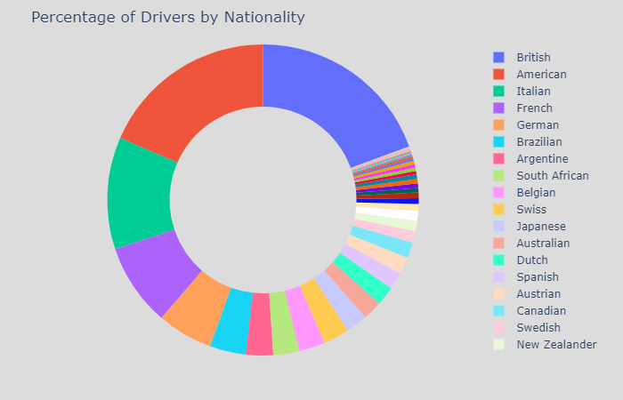
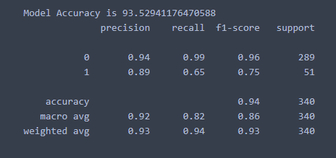

# Formula 1 Data Analysis

The purpose of this project is to analyze and explore various data points in Formula 1. I also tried to build a model to predict whether a driver will finish in the podiums or not.

## Data Collection
Initially, I had found this dataset on the popular data science community Kaggle. Then I found that this was in turn taken from the Ergast website. Since, the datasets on kaggle were quite outdated, I went to their site to find the latest data. I found Ergast has the option to use its API to gather the data so I used that to collect all data.

The dataset had multiple .CSV files with each containing primary keys to allow for merging the data. The files that originally came with the data set are:

Dataset Files:

`circuits.csv`
`constructor_results.csv`
`constructor_standings.csv`
`constructors.csv`
`driver_standings.csv`
`drivers.csv`
`lap_times.csv`
`pit_stops.csv`
`qualifying.csv`
`races.csv`
`results.csv`
`seasons.csv`
`status.csv`

All the files were merged to create a final data frame called: `final_data.csv`

## EDA

Files : `f1_analysis`

### Worldwide circuit distribution.

We see most of the circuits are concentrated in Europe, followed by America.

### Most hosted Grand Prixs?

The British and Itaian GPs have been hosted the most with a tally of 71 each.

### Most dangerous circuits?

Of course it is Monaco. With Monaco being a steet circuit, it has seen a lot of incidents. Surprisingly, Silverstone also has a fairly high record of incidents. Could be due to the fact that it has hosted the most number of GPs till date and the numbers have piled up over the years. It's not surprising to see that Monza (The temple of Speed) has seen so many incidents.

### The fastest circuits?

The temple of Speed (Monza) is no doubt the one with the highest average top speeds. However, Spa-Francorchamps and Silverstone are not that far behind. Monaco and Marina Bay have the slowest speeds. After all they are street circuits with very tight corners.

### How have lap speeds evolved over the last 10 years?

We can see that the lap speeds have obviously seen a steady increase over the last 10 years. However, we see that post 2014, the average speeds have risen faster per year post the 1.6 V6 Turbo Engine rule change.

### Some of the shortest circuits - Evident by the fast lap times.

Red Bull ring, Jose Carlos (This is shorter than the red bull ring, but the average speeds in the red bull ring are quite high), Hockenheimring. 

### Lap times over the past 10 years.

### Pit Stops

Unfortunately, we do not have pit stop information before 2011, hence, we are limited to the data points only after then. Looking at the charts, we see that the average stop time has actually gone higher up. This could be due to the pit lane speed limits. Earlier the speed limits were higher than today, hence resulting in shorter pit times. Please note, the pit time is inclusive of the stationary time and the time the car is in the pit lane.

### Number of Stops

Most circuits follow the 2-stop or 1-stop strategy. But this varies widely, depending on the weather, any incidents on track, etc.

### Constructors by Nationality

Most of the constructors that have taken part in the Grand Prixs over the years are British, followed by American teams.

### Drivers by Nationality

Most drivers are American or British by nationality followed by Italians. Most of them have entered the world or F1 racing post 25. The youngest debutant in F1 is Max Verstappen at the age of 17 years. However, due to the year wise calculation, his age is reflecting as 18 over here.

A lot more data points have been explored in the `f1_analysis.ipynb` file.

The next challenge was to try and predict whether a driver will be finishing in the podiums or not based on their performance in the Qualifiers, previous performance, etc.

I tried running only an XGBoost model and that returned a 93% accuracy.

However, this works good only for races that have been completed as there are a few variables like the fastest lap, fastest lap speed, etc which are only available post the race. I am continuously trying to improve this by doing some feature engineering. However, my primary objective on the dataset was to explore various data points and not build a prediction model.

If there are any ways I can improve this, please comment so I can make this better.
